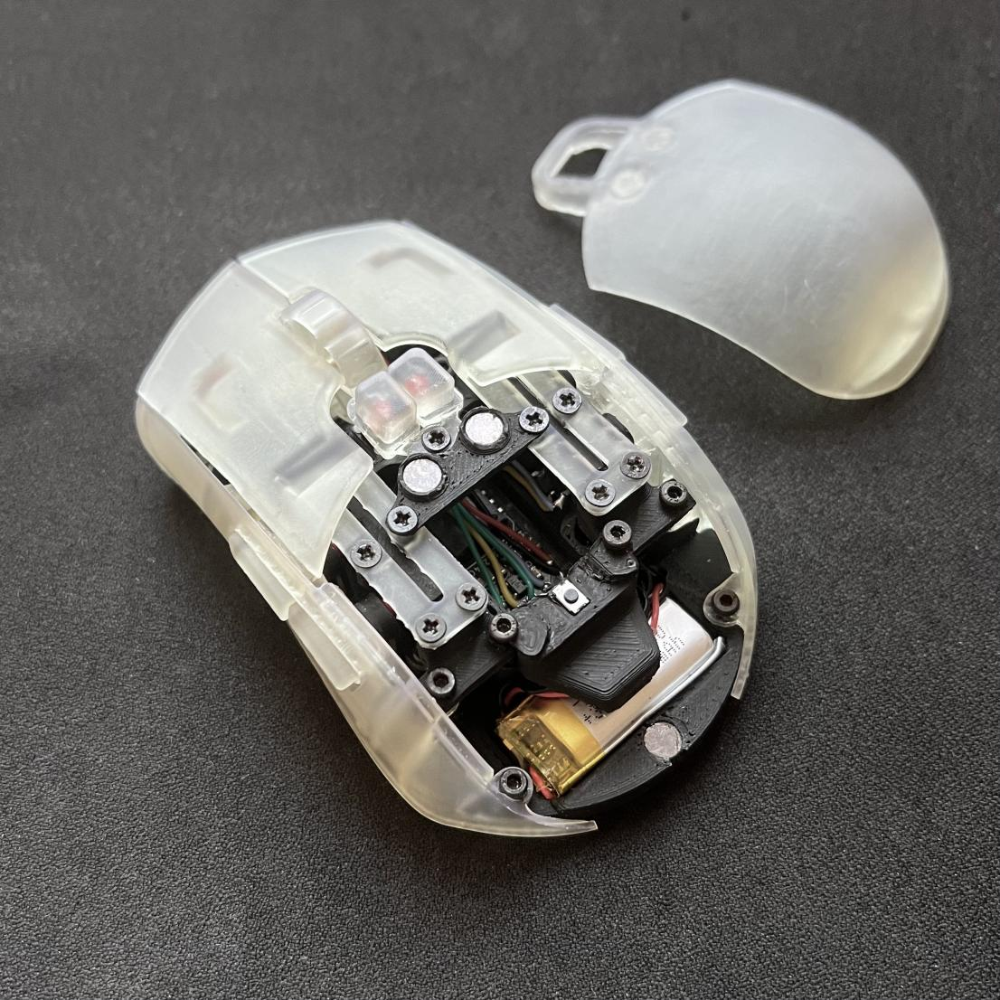

# ZMK Config for moudabella

This is the ZMK firmware config repository for [moudabella](https://github.com/badjeff/moudabella), an open source bluetooth mouse 🐭 for CAD 🐱.

*Figure 1: PLA base / Resin shell

## License

Available under the [MIT](/LICENSE) license.
